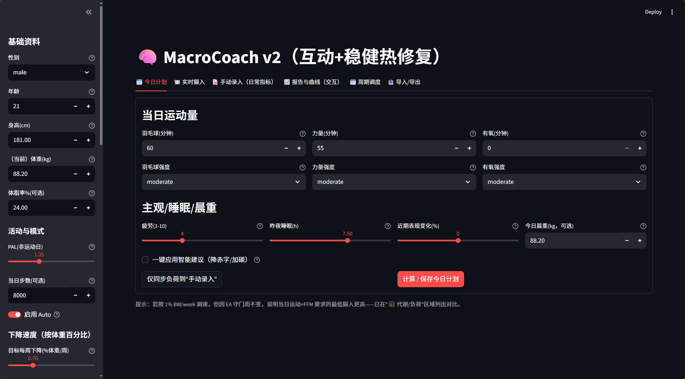
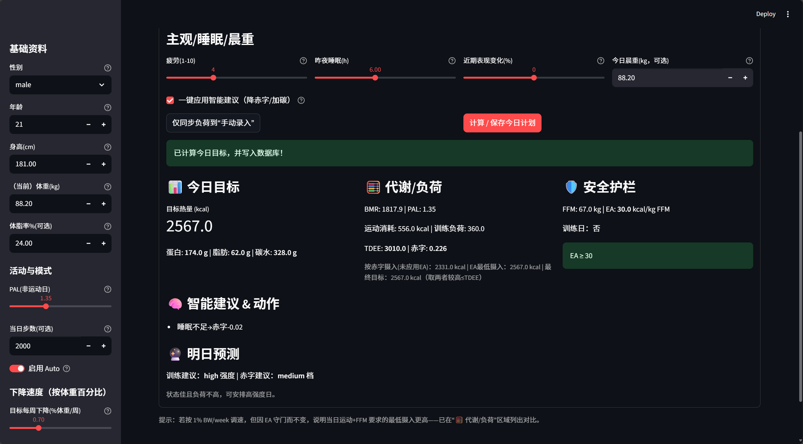
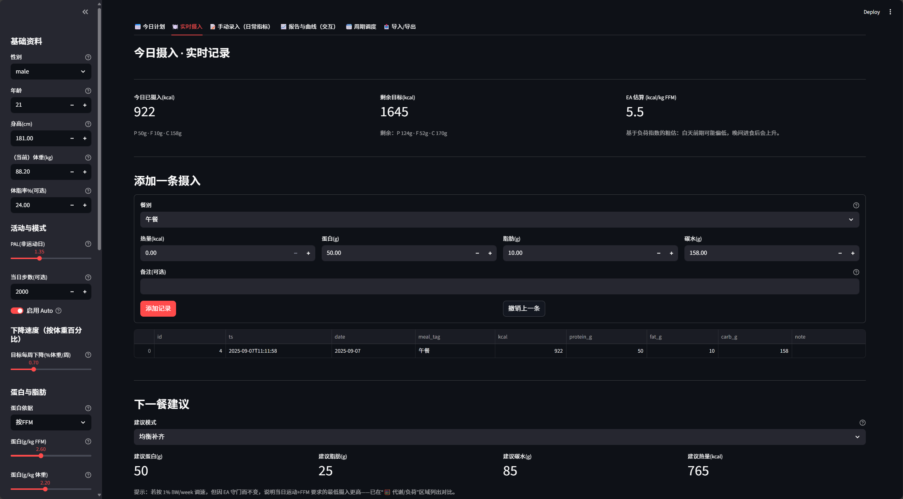
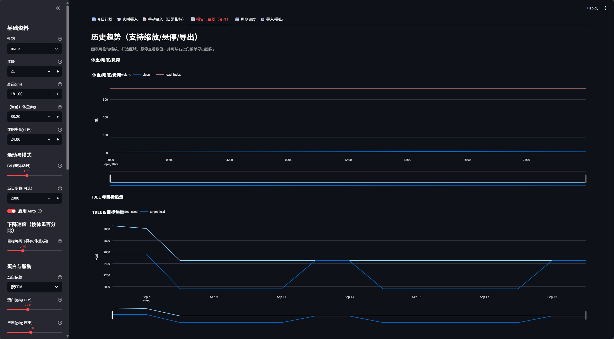
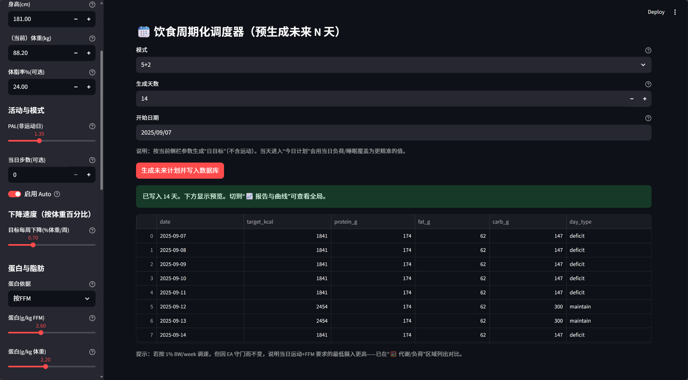

# MacroCoach v2 —— 科学健身与营养计划器

> 一个基于 **Streamlit** 的交互式应用，用于每日能量与三大营养素（P/F/C）目标规划、实时摄入记录、训练负荷管理、能量可用性（EA）安全护栏、以及周期化碳水与周计划调度。数据持久化采用 **SQLite**，支持 CSV/DB 导入导出。

## 目录
- [特性总览](#特性总览)
- [快速开始](#快速开始)
- [使用指南](#使用指南)
  - [1) 今日计划](#1-今日计划)
  - [2) 实时摄入](#2-实时摄入)
  - [3) 手动录入](#3-手动录入)
  - [4) 报告与可视化](#4-报告与可视化)
  - [5) 周期调度（预生成未来计划）](#5-周期调度预生成未来计划)
  - [6) 导入导出](#6-导入导出)
- [核心原理与算法](#核心原理与算法)
  - [BMR/TDEE 估算](#bmrtdee-估算)
  - [运动消耗与负荷指数](#运动消耗与负荷指数)
  - [目标赤字与 PID 控制](#目标赤字与-pid-控制)
  - [能量可用性 EA 与安全护栏](#能量可用性-ea-与安全护栏)
  - [碳水周期化与最小地板](#碳水周期化与最小地板)
- [数据模型（SQLite）](#数据模型sqlite)
- [配置与环境变量](#配置与环境变量)
- [开发指引](#开发指引)
- [截图](#截图)
- [常见问题](#常见问题)
- [路线图](#路线图)
- [致谢与许可](#致谢与许可)

---

## 特性总览

- 🧮 **每日目标自动规划**：基于个体参数与训练计划，计算当日热量与 P/F/C 目标。
- 🏋️ **训练负荷建模**：按项目与强度用 MET×时间估算消耗，并累计“负荷指数”用于营养分配。
- 🧭 **周下降目标→赤字反推**：支持以 **%BW/week**（体重百分比/周）设定体重变化目标。
- 🎛️ **PID 微调**：当存在历史数据时，使用 PID 控制器围绕目标变化率微调每日赤字，避免过冲。
- 🛡️ **EA 安全护栏**：计算能量可用性（Energy Availability），当低于阈值时自动抬升摄入/下调赤字。
- 🍚 **碳水周期化**：训练日按负荷强度自动增加碳水；提供最小摄入地板（避免过低碳水）。
- ✍️ **实时摄入记录 + 智能建议**：分餐记录 P/F/C/kcal，给出“下一餐建议”（均衡补齐或训练前后高碳）。
- 📈 **可视化报告**：体重/睡眠/负荷、TDEE 与目标、滚动 %BW/week、EA（日值与7日均）、蛋白达成率、近7天肌群组数等。
- 🗓️ **周期调度**：支持连续缺口、5+2、MATADOR(2+2) 等多种预生成策略，批量写入未来目标。
- 🔁 **数据导入导出**：四张表 CSV 导入/导出；数据库 `.db` 文件一键下载；健壮的类型转换。
- 🌏 **中文优先体验**：内置中文界面与字体回退（跨平台尽量开箱即用）。

---

## 快速开始

### 依赖
- Python **3.9+**（推荐 3.10/3.11）
- pip / venv
- SQLite（随 Python 自带 `sqlite3` 即可）

### 安装与运行
```bash
# 1) 克隆仓库
git clone https://github.com/Cynicismcart/-.git
cd -

# 2) 安装依赖
pip install -r requirements.txt

# 3) （可选）指定数据库文件路径（默认：项目根目录 macrocoach.db）
# Linux / macOS
export MACRO_COACH_DB_PATH="/absolute/path/to/macrocoach.db"
# Windows PowerShell
# $Env:MACRO_COACH_DB_PATH="C:\absolute\path\to\macrocoach.db"

# 4) 启动应用
streamlit run app.py
```

启动后浏览器将打开 `localhost:8501`（若未自动弹出请手动访问）。

---

## 使用指南

应用采用多标签页结构，左侧侧栏输入基础与偏好参数（身高/体重/体脂或估算、目标、训练安排、蛋白优先等），各页共享这些参数并与数据库联动。

### 1) 今日计划
- 选择当天训练项目与强度（如羽毛球 / 力量 / 有氧，各自分钟数与强度系数）。
- 基于 **BMR → TDEE → 目标赤字** 的链路计算，生成今日 **kcal 目标**与 **P/F/C**。
- 若历史数据充足，PID 会围绕“目标周下降率”微调赤字；否则按目标直接反推。
- **安全护栏**：睡眠不足、EA 过低、训练日等情形下，会限制赤字上限或提升碳水。
- 一键“写入数据库”，并展示 **BMR / PAL / TDEE / 负荷指数 / EA** 等关键指标。

### 2) 实时摄入
- 将今天的饮食按餐次或时间点逐条记录 **P/F/C/kcal**（可撤销上一条）。
- 显示“**已摄入 vs 目标**”差值，并给出 **下一餐建议**（均衡补齐或训练前后高碳）。
- 基于今日训练负荷粗估 EA 的即时水平，提示是否需要增补。

### 3) 手动录入
- 回填历史或修正记录的入口（指标、目标、摄入、训练量等）。

### 4) 报告与可视化
- 体重 & 睡眠 & 训练负荷（时间序列）
- TDEE、目标热量与达成情况
- 滚动 **%BW/week**（7d/14d）
- **EA**（日值与 7 日均值）
- 蛋白达成率、近 7 天按肌群训练**组数**
- 交互式图表（Plotly），可区间缩放与导出

### 5) 周期调度（预生成未来计划）
- 支持：连续缺口 / **5+2** / **MATADOR(2+2)** 等策略
- 按 BMR×PAL 和目标赤字计算每日 **kcal / P / F / C**，自动写入数据库
- 支持覆盖或仅填充缺失日期

### 6) 导入导出
- **导出**：四张核心表导出为 CSV；数据库 `.db` 一键下载以备份或迁移。
- **导入**：CSV 导入带有健壮的 `safe_cast`——类型不符/缺失将尽量安全转化并记录。

---

## 核心原理与算法

### BMR/TDEE 估算
- **BMR**：优先 **Katch–McArdle**（若提供体脂率/LBM），否则回退 **Mifflin–St Jeor**。
- **PAL**：由日常活动与训练负荷综合得到（可在侧栏调节或由模型估算）。
- **TDEE**：`TDEE = BMR × PAL + 当日运动消耗`。

### 运动消耗与负荷指数
- 各训练项目配置 **MET**（代谢当量），消耗估算为 `MET × 体重(kg) × 时长(h) × 系数`。
- “**负荷指数**”作为当日训练刺激强度的综合指标，用于 EA 判断与碳水分配。

### 目标赤字与 PID 控制
- 以 **%BW/week** 指定体重变化目标（正为增重，负为减重），反推 **周赤字** 与**日赤字**。
- 当存在历史体重与达成偏差时，使用 **PID** 对日赤字微调：
  - **P（比例）**：当前偏差
  - **I（积分）**：累计偏差（限制上限，防止“积分饱和”）
  - **D（微分）**：趋势变化
- 输出经上下限裁剪，避免不合理极端赤字/盈余。

### 能量可用性 EA 与安全护栏
- **EA（Energy Availability）** 近似：`EA ≈ (当日摄入 - 运动消耗) / 瘦体重(kg)`（或按体重近似）。
- 当 **EA < 阈值**（随性别/体脂/训练周期设定）时：
  - 下调赤字或抬升总摄入；优先保证蛋白与碳水最小地板
- 睡眠不足等情况也会触发 **赤字上限** 限制。

### 碳水周期化与最小地板
- 训练日根据负荷指数增加碳水（力量/有氧前后窗口更高）。
- 设定 **碳水最小地板**，防止长时间极低碳水影响训练质量与恢复。

---

## 数据模型（SQLite）

> 典型/核心字段示例，便于理解与二开。

### `daily_metrics` — 每日客观指标  
| 列名 | 类型 | 说明 |
|---|---|---|
| date | DATE (PK) | 日期 |
| weight_kg | REAL | 体重 |
| sleep_h | REAL | 睡眠时长 |
| notes | TEXT | 备注 |

### `daily_targets` — 每日目标（计算与/或调度写入）  
| 列名 | 类型 | 说明 |
|---|---|---|
| date | DATE (PK) | 日期 |
| kcal | INTEGER | 当日总热量目标 |
| protein_g | INTEGER | 蛋白目标（g） |
| fat_g | INTEGER | 脂肪目标（g） |
| carbs_g | INTEGER | 碳水目标（g） |
| deficit_kcal | INTEGER | 目标赤字（kcal） |
| day_type | TEXT | 训练日/休息日/再馈日等 |
| ea_guard_applied | INTEGER | 是否触发 EA 护栏（0/1） |

### `intake_logs` — 实时摄入记录  
| 列名 | 类型 | 说明 |
|---|---|---|
| ts | DATETIME (PK) | 记录时间 |
| meal_label | TEXT | 餐次/标签 |
| protein_g/fat_g/carbs_g | INTEGER | 三大营养素 |
| kcal | INTEGER | 能量 |
| note | TEXT | 备注 |

### `weekly_volume` — 训练量（以周-肌群为粒度）  
| 列名 | 类型 | 说明 |
|---|---|---|
| week_start | DATE (PK1) | 周起始（周一） |
| muscle_group | TEXT (PK2) | 肌群名（胸背腿肩等） |
| sets | INTEGER | 该周有效组数 |

---

## 配置与环境变量
- `MACRO_COACH_DB_PATH`：自定义 SQLite 文件路径（默认：项目根目录 `macrocoach.db`）。
- 字体/国际化：内置中文字体优先/回退列表，保证图表与中文显示。

---

## 开发指引

### 代码结构（概览）
```
.
├── app.py                # 入口：注册各标签页、状态与路由
├── requirements.txt
└── macrocoach_v2/
    ├── domain/           # 核心领域模型与公式（BMR/TDEE、EA、周期化等）
    ├── services/         # 业务服务（PID 控制、计划生成、建议生成）
    ├── data/             # 数据层（SQLite 连接、建表/迁移、DAO、聚合查询）
    ├── ui/               # 各标签页实现（今日计划、实时摄入、报告、调度、导入导出等）
    └── utils/            # 常量、字体/样式、通用工具（clamp/safe_cast 等）
```

> 建议：计算与 UI 分层；所有 I/O 经 `data/*`；公共常量集中管理；PID 参数可配置并设定上下限。

---

## 截图

**首页（Home）**  
[](docs/images/home.png)  
*说明：展示应用标题、标签页导航，以及侧栏中的身高/体重/体脂、目标（%BW/week）与 PAL 等基线参数。*

**今日计划（Plan）**  
[](docs/images/plan.png)  
*说明：填写当日训练（分钟与强度），自动计算当日 kcal 与 P/F/C 目标；下方显示 BMR / PAL / TDEE、训练负荷指数与 EA。*

**实时摄入（Intake）**  
[](docs/images/intake.png)  
*说明：逐条记录 P/F/C/kcal，查看“已摄入 vs 目标”差值，并获得“下一餐建议”。支持撤销上一条记录。*

**报告（Reports）**  
[](docs/images/report.png)  
*说明：体重/睡眠/训练负荷时间序列，TDEE 与目标对比，滚动 %BW/week，EA（日值与 7 日均），蛋白达成率与近 7 天肌群组数等交互式图表。*

**周期调度（Scheduler）**  
[](docs/images/scheduler.png)  
*说明：选择策略（连续缺口 / 5+2 / MATADOR 2+2），设置生成天数，预览并写入未来每日的 kcal 与 P/F/C 目标；支持仅填缺失或覆盖已有。*


---

## 常见问题

**Q: 首次进入页面没有“今日目标”，怎么办？**  
A: 在“实时摄入”或“今日计划”页可一键按侧栏参数生成“基线目标”，或先到“周期调度”预生成未来数天。

**Q: EA 总是偏低？**  
A: 检查训练负荷是否录入过高；在“今日计划”页调高 PAL 的基线或调低目标周下降率；确保蛋白与碳水最小地板未被压缩。

**Q: 导入 CSV 报错？**  
A: 使用项目导出的 CSV 模板格式；导入模块内置 `safe_cast`，会尽力兼容类型与缺失值，但列名需匹配。

---

## 路线图
- [ ] 更细粒度的运动项目库与 MET 表来源说明
- [ ] 体重/围度/主观疲劳等更全面的指标面板
- [ ] 更丰富的报告（分餐宏达成、周/月总结）
- [ ] 多用户隔离（按 profile_id 分区）
- [ ] 单元测试完善与 CI（GitHub Actions）
- [ ] i18n 多语言切换与深色模式优化

---

## 致谢与许可
- 公式与思路参考通用营养学与运动生理学实践范式（Mifflin–St Jeor、Katch–McArdle、MET 等）。
- 若用于科研或商业，请在论文/应用中注明引用本项目。
- **License**：尚未选择开源协议，建议添加 `LICENSE`（如 MIT / Apache-2.0）。

